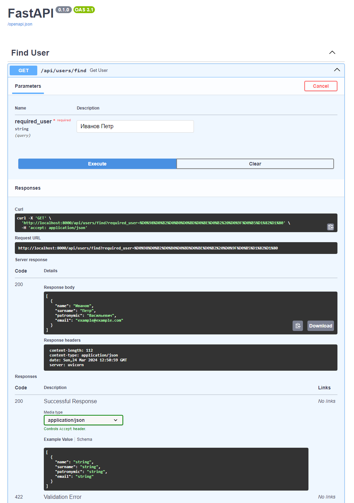

# Smart Found App



## Запуск на локальной машине

1. Склонировать проект, по необходимости создать виртуальное окружение и
установить все зависимости
      ```bash
      pip install -r requirements.txt
      ```

2. Запустить приложение
      ```bash
      uvicorn main:app --port 8000 --host localhost
      ```
3. Перейти по ссылке для просмотра документации по API:
    > http://localhost:8000/docs

4. Через WEB интерфейс отправлять по маршруту `/api/users/find` запросы
для тестирования системы, вписывая запрос для поиска в поле `required_user`

- Либо, можно отправлять запросы напрямую в адресной строке браузера или посредством
других утилит, таких как `curl`, подставляя строку для поиска в параметр
запроса `required_user` вместо `USER`
    > http://localhost:8000/api/users/find?required_user=USER

---

Данное приложение было написано на финале Всероссийской олимпиады студентов
«Я — профессионал» для демонстрации работы умного поиска в базе данных.
